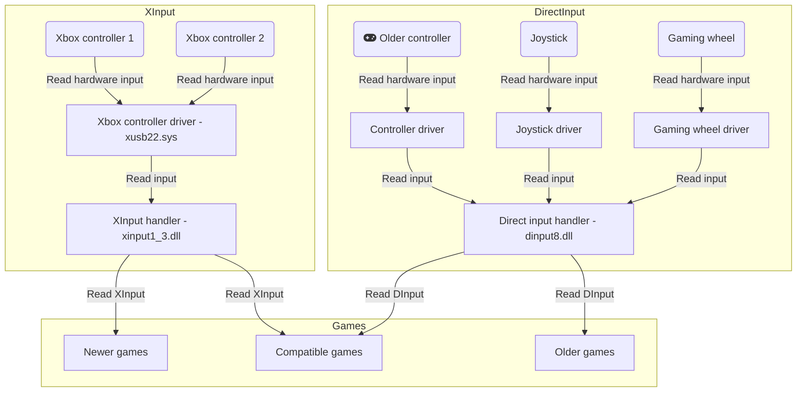
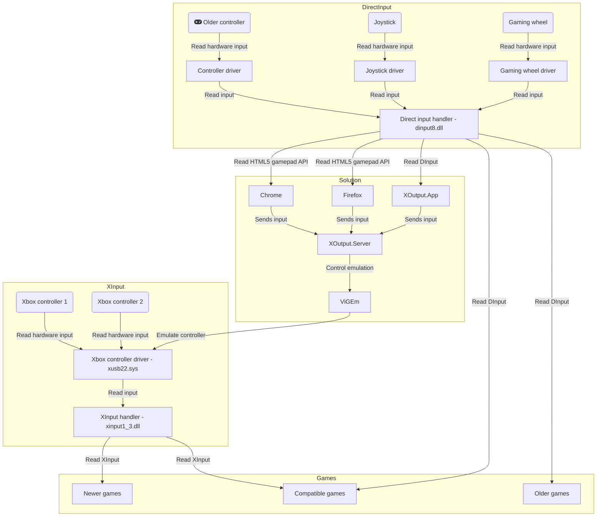

# XOutput

If you have an older or not supported game controller (gamepad, wheel, joystick, etc.),
but XBox 360 controllers are supported you can use this software and enjoy gaming with your controller.

XOutput is a software that can convert [DirectInput](https://docs.microsoft.com/en-us/previous-versions/windows/desktop/ee416842(v=vs.85)) into [XInput](https://docs.microsoft.com/en-us/windows/win32/xinput).
DirectInput data is read and sent to a virtual XInput (Xbox 360 Controller) device.
XInput is the new standard game controller input on windows, and DirectInput can no longer be used with [Universal Windows Platform](https://docs.microsoft.com/en-us/windows/uwp/) software, but with this tool you can use DirectInput devices as well.

Problem visualisation

Offered solution

## General information

If you have any questions or feature requests feel free to create [Github Issue](https://github.com/csutorasa/XOutput/issues).

Any contribution is welcome, open your [Pull request](https://github.com/csutorasa/XOutput/pulls).

To join the discussion or just say hi, there is a [discord channel](https://discord.gg/Y628tcp).

**This version is currently under development. Please use [3.x](https://github.com/csutorasa/XOutput/tree/3.x) version for stable features**

| Version                                              | State                                   | Support                                  |
| ---------------------------------------------------- | --------------------------------------- | ---------------------------------------- |
| **[4.x](https://github.com/csutorasa/XOutput)**      | **Under development (no releases yet)** | **Active development with new features** |
| [3.x](https://github.com/csutorasa/XOutput/tree/3.x) | Stable                                  | Bugfixes only                            |
| 2.x                                                  | Old version (superseeded by 3.x)        | Expired at Mar 7 2018                    |
| 1.x                                                  | Old version (superseeded by 3.x)        | Expired at Mar 7 2018                    |

## How to install

### Install emulation software

Install one of the two libraries. ViGEm (preferred) or SCPToolkit (unsupported, legacy)

| Software                                            | State                         | Download                                                            |
| --------------------------------------------------- | ----------------------------- | ------------------------------------------------------------------- |
| [ViGEmBus](https://github.com/nefarius/ViGEmBus)    | Deprecated since Sep 8, 2023  | [ViGEmBus](https://github.com/nefarius/ViGEmBus/releases)           |
| [ScpToolkit](https://github.com/nefarius/ScpServer) | Deprecated since Mar 20, 2023 | [ScpToolkit](https://github.com/nefarius/ScpServer/releases/latest) |

### Install dependencies

Install:

-   DirectX
-   Visual C++ Redistributable for Visual Studio 2015 32-bit
-   Visual C++ Redistributable for Visual Studio 2015 64-bit
-   all the drivers for your controllers
-   [.NET 7 ASP.NET and Desktop runtime](https://dotnet.microsoft.com/download)
-   if you have issues, install the official [XBox 360 controller drivers](https://www.microsoft.com/accessories/en-gb/d/xbox-360-controller-for-windows).

### Download XOutput

-   Download the [latest stable release](https://github.com/csutorasa/XOutput/releases/latest)
-   Unzip to any directory

## How to upgrade

Download the application:

-   Download the [latest stable release](https://github.com/csutorasa/XOutput/releases/latest)
-   Unzip to the same directory as before
-   If there are errors, remove the existing `conf` directory

## How it works

| Component         | Implementation | Description                                                                                                                     |
| ----------------- | -------------- | ------------------------------------------------------------------------------------------------------------------------------- |
| Device emualation | ViGEm          | External software that emulates XBox and DS4 controllers                                                                        |
| Device emualation | SCP toolkit    | Legacy external software that emulates XBox controllers                                                                         |
| Backend           | XOutput.Server | Server that collects data from clients and sends to the emulation software                                                      |
| Client            | XOutput.App    | Desktop application that collects data from the devices and sends to the backend                                                |
| Client            | Web controller | Web application that allows to emulate a device                                                                                 |
| Client            | Web client     | Web application that uses the [Gamepad API](https://developer.mozilla.org/en-US/docs/Web/API/Gamepad_API/Using_the_Gamepad_API) |

## Hiding original input (exclusive mode)

| Software                                               | State                         | Download                                                                                    |
| ------------------------------------------------------ | ----------------------------- | ------------------------------------------------------------------------------------------- |
| [HidHide](https://github.com/nefarius/hidhide)         | Active development            | [HidHide](https://github.com/nefarius/HidHide/releases)                                     |
| [HidGuardian](https://github.com/nefarius/hidguardian) | Deprecated since Jul 27, 2023 | [HidGuardian](https://docs.nefarius.at/projects/HidGuardian/HidGuardian-Gen1-Installation/) |

### HidGuardian

Affected devices and whitelist can be managed by the application, but it needs administrator priviledges.

1.  Enable HidGuardian initialization in the settings.
2.  Restart the application as administrator.
3.  Add device to affected devices in the input settings.
4.  Reconnect device or reboot PC

Add affected device manually (use this method only, if you want to hide non recognized HID devices):

1.  Run `regedit` and go to `HKEY_LOCAL_MACHINE\SYSTEM\CurrentControlSet\Services\HidGuardian\Parameters`
2.  Create `multi-string` value with the name `AffectedDevices`
3.  Open Device Manager, find your input device and open properties
4.  Go to details, select `Hardware ID` and copy string that looks like `HID\VID_046D&PID_C219&REV_0200` and `HID\VID_046D&PID_C219`
5.  Paste the values into `HKEY_LOCAL_MACHINE\SYSTEM\CurrentControlSet\Services\HidGuardian\Parameters`
6.  Reconnect devices or reboot PC

Manage process whitelist manually (use this method only, if you want to use HidGuardian for other applications):

1.  Start XOutput (or any other application)
2.  Open Task Manager, find your application, then go to details.
3.  Remember the value of the PID column.
4.  Run `regedit` and go to `HKEY_LOCAL_MACHINE\SYSTEM\CurrentControlSet\Services\HidGuardian\Parameters\Whitelist`
5.  Create subkey with the PID you found before.

## Developer Information

The 4.x version backend is built with .NET 7, you will need to [download it](https://dotnet.microsoft.com/download).

| Action                         | Required dependency  |
| ------------------------------ | -------------------- |
| Running the server application | ASP.NET Core Runtime |
| Running the reader application | .NET Desktop Runtime |
| Building the application       | SDK                  |

However these runtimes and SDKs are cross platform the application is only compatible with Windows.

### Server application

The server application is responsible for:

- collecting input from various sources
- mapping these sources
- emulating devices
- configuring all the above

It is recommended to create a Windows task from the server,
so it can start at computer startup (with Administrator priviledges without UAC).
Help can be found in the [bin directory](./bin).

Server application might write the registry, therefore it needs administrator prividledges.
Alternatively it can be started without admin access, but then when it tries to write the registry it will prompt UAC.

### Webapp

The web application required Node 16 to build it, you can [download it](https://nodejs.org/en/download/).
It can be found in the [web directory](./@xoutput).

### Reader application

The reader application is a GUI Windows application which can read input values.

| Interface    | Devices                       | Requirements                            |
| ------------ | ----------------------------- | --------------------------------------- |
| Windows API  | Mouse and keyboard            | None                                    |
| Raw input    | Mouse, keyboard and joysticks | USB device with drivers                 |
| Direct input | Joysticks                     | DirectX compatible devices with drivers |
| XInput       | Joysticks                     | XInput compatible devices               |

### Client project

The client project enabled developers to create a new type of input.
It can be used to integrate with the server application.
