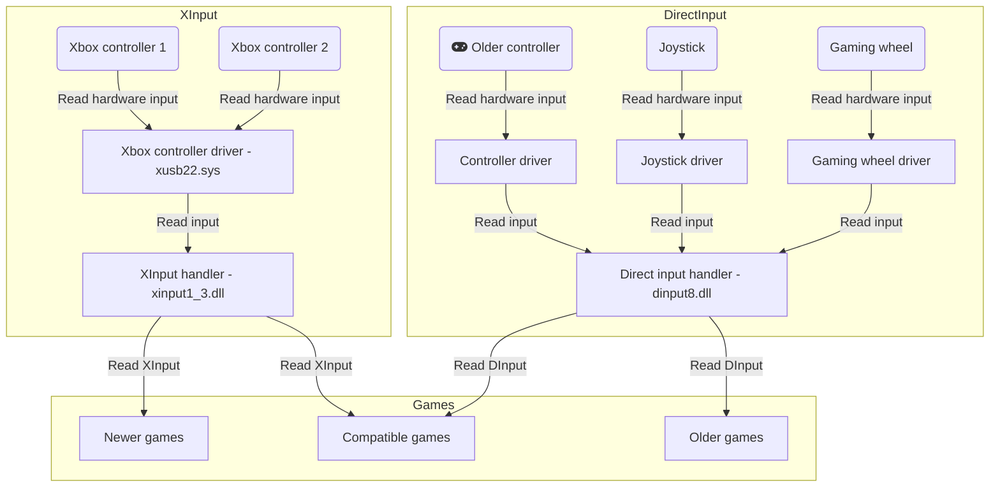
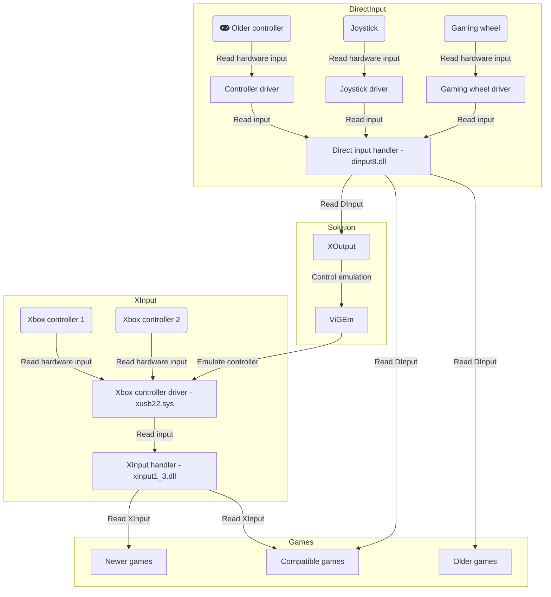

# XOutput

If you have an older or not supported game controller (gamepad, wheel, joystick, etc.),
but XBox 360 controllers are supported you can use this software and enjoy gaming with your controller.

XOutput is a software that can convert [DirectInput](https://docs.microsoft.com/en-us/previous-versions/windows/desktop/ee416842(v=vs.85)) into [XInput](https://docs.microsoft.com/en-us/windows/win32/xinput).
DirectInput data is read and sent to a virtual XInput (Xbox 360 Controller) device.
XInput is the new standard game controller input on windows, and DirectInput can no longer be used with [Universal Windows Platform](https://docs.microsoft.com/en-us/windows/uwp/) software, but with this tool you can use DirectInput devices as well.

Problem visualisation

Offered solution

## General information

To join the discussion or just say hi in the [discord channel](https://discord.gg/Y628tcp).

**This application is deprecated as the emulation softwares it used are no longer supported.**

| Version                                                  | State                            | Support               |
| -------------------------------------------------------- | -------------------------------- | --------------------- |
| [4.x](https://github.com/csutorasa/XOutput)              | No releases                      | Unreleased            |
| **[3.x](https://github.com/csutorasa/XOutput/tree/3.x)** | **Unsupported**                  | Expired at Dec 3 2024 |
| 2.x                                                      | Old version (superseeded by 3.x) | Expired at Mar 7 2018 |
| 1.x                                                      | Old version (superseeded by 3.x) | Expired at Mar 7 2018 |

## How to install

### Install emulation software

Install one of the two libraries. ViGEm (unsupported) or SCPToolkit (unsupported)

a) Install [VIGEm framework](https://github.com/ViGEm/ViGEmBus/releases/latest) (recommended)

b) Install [ScpToolkit](https://github.com/nefarius/ScpServer/releases/latest) and all of its dependencies described [here](https://github.com/nefarius/ScpToolkit/blob/master/README.md#installation-requirements)

### Install dependencies

Install:

-   DirectX
-   Visual C++ Redistributable for Visual Studio 2015 32-bit
-   Visual C++ Redistributable for Visual Studio 2015 64-bit
-   all the drivers for your controllers
-   [.Net Framework 4.5.2](https://www.microsoft.com/en-us/download/details.aspx?id=42642) if you do not have Windows 10 or newer
-   if you have issues, install the official [XBox 360 controller drivers](https://www.microsoft.com/accessories/en-gb/d/xbox-360-controller-for-windows).

### Download XOutput

-   Download the [latest stable release](https://github.com/csutorasa/XOutput/releases/latest)
-   Unzip to any directory

## How to upgrade

Download the application:

-   Download the [latest stable release](https://github.com/csutorasa/XOutput/releases/latest)
-   Unzip to the same directory as before
-   Delete the old `settings.json` file before starting the application and configure the controllers again

## How to use

If all the requirements are installed, the software should start up without any error messages.

### Input devices

Input devices can be checked and configured individually.
Input values can be seen in the input fields.
Force feedback can be disabled for each device.

### Game controllers

The available input devices are shown in the Game Controllers section. Choose a device and click `Edit`.

On the configuration screen there are 3 blocks. The left block shows the input, the right one shows the emulated output and in the middle is where the mapping can be set. For each output axis or button, you can choose from the input axes and buttons.

1.  Press `Configure All` to set the mapping all at once, or press `Configure` on each field to set them individually.
2.  Press the button or move the axis from one end to the other.
3.  Check your mapping comparing the input and output blocks.
4.  If needed, you can apply deadzone values to axes. (more info below)
5.  Close the configuration window
6.  Save the settings using the `File->Save` menu or the button located at the bottom right of the main window.
7.  Select `Start` on the device.

You can check if it is working in the Windows settings, or just select `File->Game controllers`, that opens the Windows calibration for you. An Xbox gamepad should have appeared in the list.

## HidGuardian (exclusive mode)

-   Install [HidGuardian](https://vigem.org/projects/HidGuardian/HidGuardian-Gen1-Installation/).

Affected devices and whitelist can be managed by the application, but it needs administrator priviledges.

1.  Enable HidGuardian initialization in the settings.
2.  Restart the application as administrator.
3.  Add device to affected devices in the input settings.
4.  Reconnect device or reboot PC

Add affected device manually (use this method only, if you want to hide non recognized HID devices):

1.  Run `regedit` and go to `HKEY_LOCAL_MACHINE\SYSTEM\CurrentControlSet\Services\HidGuardian\Parameters`
2.  Create `multi-string` value with the name `AffectedDevices`
3.  Open Device Manager, find your input device and open properties
4.  Go to details, select `Hardware ID` and copy string that looks like `HID\VID_046D&PID_C219&REV_0200` and `HID\VID_046D&PID_C219`
5.  Paste the values into `HKEY_LOCAL_MACHINE\SYSTEM\CurrentControlSet\Services\HidGuardian\Parameters`
6.  Reconnect devices or reboot PC

Manage process whitelist manually (use this method only, if you want to use HidGuardian for other applications):

1.  Start XOutput (or any other application)
2.  Open Task Manager, find your application, then go to details.
3.  Remember the value of the PID column.
4.  Run `regedit` and go to `HKEY_LOCAL_MACHINE\SYSTEM\CurrentControlSet\Services\HidGuardian\Parameters\Whitelist`
5.  Create subkey with the PID you found before.

## Command line arguments

-   `--minimized` - starts the application minimized to tray

### Deadzone

If your analogue stick isn't in perfect condition, you may have what is called a deadzone, which means that a part of the axis isn't working right, usually it's the center part, syndromes of this are: wrong center position and unwanted movement of the camera, character, etc. To solve apply a bit of deadzone in the mapping settings, how much depends on the device in question.

## Diagnostics

XOutput has a diagnostics screen. A few tests are run to check if the application is working correctly.

| Image                                    | Meaning                                                                                                 |
| ---------------------------------------- | ------------------------------------------------------------------------------------------------------- |
| green circle with a tick                 | Everything is optimal.                                                                                  |
| yellow triangle with an exclamation mark | The experience may be sub-optimal. Some functions may not work, but the application is functional.      |
| red circle with a minus sign             | Something is not working, the application cannot function properly. Some core features may be unusable. |
